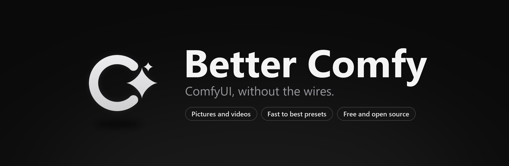

<p align="center">
  
</p>

<p align="center">
  <a href="https://github.com/slashneck/BetterComfy/releases/latest"></a>
  <a href="https://github.com/slashneck/BetterComfy/releases"></a>
  
  <a href="LICENSE"></a>
</p>

<p align="center">
  <a href="https://github.com/slashneck/BetterComfy/releases/latest"><b>Download for Windows</b></a>
  &nbsp;&nbsp;|&nbsp;&nbsp;
  <a href="#features">Features</a>
  &nbsp;&nbsp;|&nbsp;&nbsp;
  <a href="#what-you-need">What you need</a>
  &nbsp;&nbsp;|&nbsp;&nbsp;
  <a href="#building">Build it yourself</a>
</p>

<br>

Better Comfy makes pictures and videos with the ComfyUI on your PC, without a single node to wire. Pick a model, write
what you want, slide from Ultra Fast to Best and press Generate. It finds ComfyUI by itself (Pinokio, the portable
build or ComfyUI Desktop), starts it when needed and reads your models, LoRAs and upscalers from it.

## Features

**Pictures.** SDXL, Pony, Illustrious, SD 1.5, Flux, Qwen-Image, Anima, Z-Image and Krea 2. Better Comfy reads what a model is
from inside the file and sets the size, steps, sampler, guidance, clip skip and the usual quality words for it. Five
presets from Ultra Fast to Best, with an upscale pass for the top two. Speed models (Lightning, Hyper, DMD2, Turbo) are
spotted and run with few steps by themselves. Every fine control is still there under Advanced.

**Videos.** WAN 2.2 and 2.1, from a picture or from words only. Seamless loops that find the smoothest loop point and
blend the seam, ping-pong, crossfade, start to end picture. Smoothing up to 4x the frame rate, steady colours, MP4, WebM
or GIF. Extend a video from its last frame and get both parts as one longer video. Drop a whole folder of pictures to
animate them all.

**Edit and upscale.** Paint over a part of a picture, say what should be there, and only that part is drawn new. Make
any picture bigger and sharper with its own model, prompt and seed, or just enlarge it with an upscale model.

**Compare.** The same picture with one setting changed (seeds, guidance, steps, sampler, scheduler, preset, LoRA
strength or model), side by side.

**A LoRA library.** Every LoRA in your ComfyUI with what it was made for (Illustrious, Pony or plain SDXL told apart
from the training details, and settable by hand), its trigger words (suggested from the file), notes, the page you got
it from, a favourite strength and a preview picture. Sort them with tags (character, art style, pose, detailer and your
own), and blur the names and previews of NSFW ones if you like. WAN LoRAs that come as a high and a low file are paired
up and share their trigger words. Click a trigger word to put it into the prompt.

**A queue.** Pictures and videos one after the other, with time estimates learned on your PC. Take single pictures out
of a job, stop one while the rest goes on, and choose what happens when the queue is done: nothing, free the graphics
memory, stop ComfyUI, close the app, sleep or shut down.

**A gallery.** Everything you made, with its settings. Reuse them, view pictures big with zoom, join videos, animate or
upscale from there. Pictures keep their settings inside the file, and dropping one onto ComfyUI opens its workflow.
Favourite with F, mark with X and delete everything marked at once, sort by date, type, model or LoRA, filter and search,
and keep pictures in collections (also smart ones that fill themselves by model or LoRA).

**A vault.** Pictures and videos that only open with your password, encrypted with Argon2id and AES-256-GCM and only
ever decrypted in memory. Turn on Private next to Generate and the result goes straight into the vault, without a copy
in your folders or in ComfyUI's. Move pictures in later, take them out again, or animate, upscale and edit them without
them leaving the vault. A recovery key, auto lock, and a re-encrypt option when you change the password.

**Deleting for good.** Deleted files can go to the Recycle Bin, be shredded (overwritten, renamed and then deleted) or be
handed to Eraser if it is installed.

**A prompt helper.** Small language models that improve, extend, shorten or write prompts, as tags or as sentences
depending on the model, and write motion for videos. Uncensored writing models (Qwen3.5 2B, 4B or 9B) and TIPO, a model
made only for Danbooru tags. They run on the processor, so the graphics card stays free. All optional: pick them in
Settings and each downloads once (1 to 5 GB) to a folder you pick, or use a `.gguf` model you already have. Tag models
also get tag suggestions while you type, with a tag blacklist you can edit.

**Screen capture blocking.** Screenshots, recordings and screen sharing can't see Better Comfy, either always or while
the vault is open.

**Little things.** Your own presets, live previews while a picture is drawn, prompt history, Ctrl+Enter to generate,
Ctrl+Up and Down to weight a word, `{a|b|c}` to pick one per picture, accent colours and a tray icon.

## What you need

- Windows 10 or 11, 64 bit, and a graphics card that runs ComfyUI.
- ComfyUI. The easiest way is [Pinokio](https://pinokio.co): open Discover and install ComfyUI. The portable ComfyUI
  and ComfyUI Desktop work too.
- Models in ComfyUI's model folders. For pictures, an SDXL checkpoint in `models/checkpoints` is enough to start. For
  videos, a WAN 2.2 image to video pair (or a WAN 2.1 model) in `models/diffusion_models`, its text encoder in
  `models/text_encoders` and the WAN VAE in `models/vae`. Settings, Setup check lists what is there and what is missing.

## Install

Download `BetterComfySetup` from the [latest release](https://github.com/slashneck/BetterComfy/releases/latest) and run
it. It installs for your Windows account only, so no admin rights are needed, and it keeps itself up to date.

The setup isn't code signed yet, so Windows SmartScreen may say it "protected your PC". Click **More info** and then
**Run anyway**. Every release lists the SHA-256 checksum of its files.

On the first start Better Comfy looks for ComfyUI. If it can't find it, pick the ComfyUI folder once and you are done.

## Where your files are

| What | Where |
| --- | --- |
| Pictures | `Pictures\Better Comfy` (changeable) |
| Videos | `Videos\Better Comfy` (changeable) |
| Settings, gallery, LoRA notes, the vault | `%LocalAppData%\BetterComfy` |
| Prompt helper (if set up) | the folder you pick |
| The program | `%LocalAppData%\Programs\BetterComfy` |

Updates only replace program files. Uninstalling removes the program and leaves your pictures, videos, settings and
gallery where they are.

## Privacy

Everything you make stays on your PC. Better Comfy only talks to the ComfyUI on this computer, and a ComfyUI it starts
itself only listens on this computer. There is no account, no telemetry and no upload. Better Comfy goes online to ask GitHub
whether a new version exists (you can switch that off under Settings, Updates) and, only when you ask for it, to
download prompt helper models or missing model parts once from Hugging Face and GitHub. The prompt helper itself runs on
your PC.

## Building

You need Python 3.12 and the .NET 8 SDK.

```powershell
.\build-release.ps1
```

The script sets up the Python packages from `requirements.txt`, builds Better Comfy and writes the setup, the update zip
with its checksum and a source zip to `dist`. For development, run `python main.py` after
`pip install -r requirements.txt`.

## License

Copyright (C) 2026 slashneck. Better Comfy is free software under the
[GNU General Public License version 3](LICENSE): you can use, change and share it, and any version you share has to
stay under the same license with its source code available. The license doesn't cover the Better Comfy name or logo
(GPLv3 section 7e), so please give modified versions their own name.

Better Comfy is not made by or connected to the ComfyUI team. It includes Qt, PySide6, FFmpeg, cryptography,
argon2-cffi, a Danbooru tag list and the Python runtime.
See [THIRD-PARTY-NOTICES.md](THIRD-PARTY-NOTICES.md).
